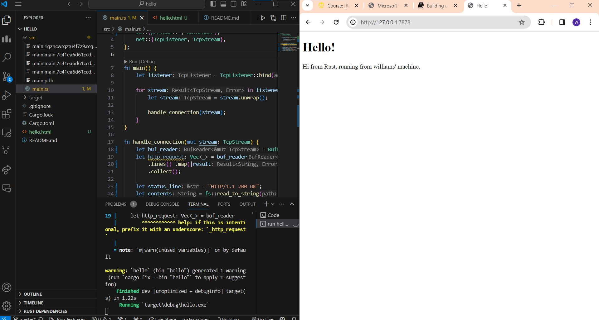

# Reflection
## Commit 1
Pertama, pada method handle_connection kita menerima parameter stream yang berguna untuk membaca data dari TCP Stream. Pada baris pertama dari method handle_connection yang merupakan potongan kode dibawah ini, kita membuat sebuah BufReader baru untuk menghandle pembacaan IO dari stream. 

```
let buf_reader = BufReader::new(&mut stream);
```

Kemudian, baris kedua dari method handle_connection yang merupakan potongan kode dibawah ini, kita membuat variabel http_request untuk mengumpulkan request yang kita kirim ke server (yang di mana pada kasus ini ke http:127.0.0.1:7878). 

```
let http_request: Vec<_> = buf_reader
    .lines()
    .map(|result| result.unwrap())
    .take_while(|line| !line.is_empty())
    .collect();
```

Karena terdapat deklarasi Vec<_> maka kita akan menyimpan request yang dikirim ke Vector tersebut. Fungsi .lines() berguna untuk memisahkan String data dari stream ketika bertemu dengan \n. Kemudian, untuk mendapatkan setiap String yang ada, kita melakukan map dan unwrap setiap dari String tersebut yang di mana kita memanfaatkan result untuk unwrap tersebut. Setelah itu, .take_while(|line| !line.is_empty()) akan berhenti ketika dia menemukan line yang kosong dan setelah berhenti maka kita akan menggabungkan semua hasil ke Vector tersebut.

Dan terakhir, kita akan print output dari http_request tersebut.
```
println!("Request: {:#?}", http_request);
```

## Commit 2


Terdapat beberapa kode yang ditambahkan kepada method handle_connection:
1. let status_line = "HTTP/1.1 200 OK"; 
    - Penambahan variabel status_line ini bertujuan untuk memberikan status code sebagai response dari request yang diberikan, yang di mana status code yang bernilai 200 menandakan bahwa request yang diberikan oleh pengguna berhasil diterima oleh server dan dikembalikan kepada pengguna.
1. let contents = fs::read_to_string("hello.html").unwrap(); 
    - Kode ini berfungsi untuk membaca file hello.html dan mengubahnya menjadi dalam bentuk string
1. let length = contents.len();
    - Kode ini berfungsi untuk menghitung panjang string dari contents. Karena contents merupakan variabel untuk menyimpan String hasil pembacaan hello.html, maka pada variabel length akan berisikan panjang dari isi html code untuk  hello.html
1. let response = format!("{status_line}\r\nContent-Length: {length}\r\n\r\n{contents}");
    - Kode ini berfungsi untuk membuat String response yang di mana dibuat dengan menggunakan String formatting yang akan ditambahkan ke success response
1. stream.write_all(response.as_bytes()).unwrap();
    - Kode ini berfungsi untuk menuliskan variabel response ke dalam bentuk bytes ke dalam stream.