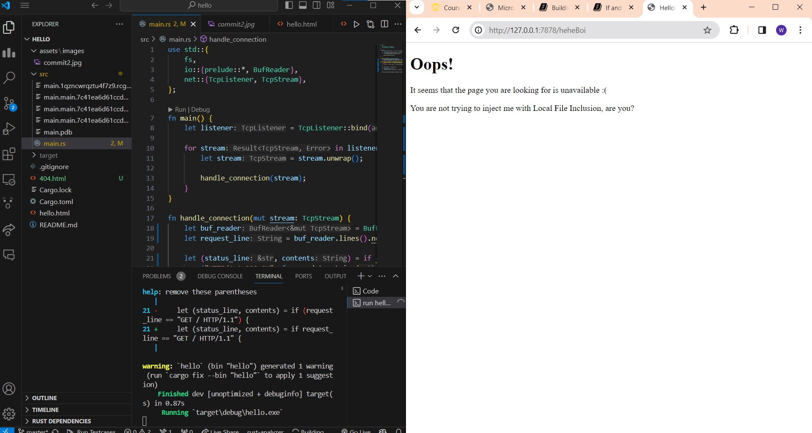
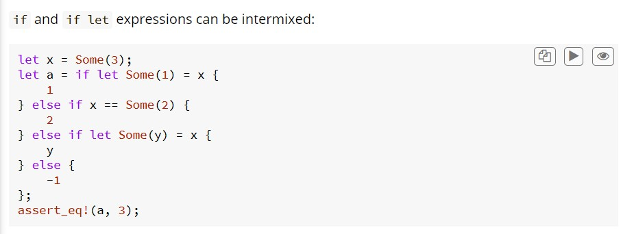

# Reflection
## Commit 1
Pertama, pada method handle_connection kita menerima parameter stream yang berguna untuk membaca data dari TCP Stream. Pada baris pertama dari method handle_connection yang merupakan potongan kode dibawah ini, kita membuat sebuah BufReader baru untuk menghandle pembacaan IO dari stream. 

```
let buf_reader = BufReader::new(&mut stream);
```

Kemudian, baris kedua dari method handle_connection yang merupakan potongan kode dibawah ini, kita membuat variabel http_request untuk mengumpulkan request yang kita kirim ke server (yang di mana pada kasus ini ke http:127.0.0.1:7878). 

```
let http_request: Vec<_> = buf_reader
    .lines()
    .map(|result| result.unwrap())
    .take_while(|line| !line.is_empty())
    .collect();
```

Karena terdapat deklarasi Vec<_> maka kita akan menyimpan request yang dikirim ke Vector tersebut. Fungsi .lines() berguna untuk memisahkan String data dari stream ketika bertemu dengan \n. Kemudian, untuk mendapatkan setiap String yang ada, kita melakukan map dan unwrap setiap dari String tersebut yang di mana kita memanfaatkan result untuk unwrap tersebut. Setelah itu, .take_while(|line| !line.is_empty()) akan berhenti ketika dia menemukan line yang kosong dan setelah berhenti maka kita akan menggabungkan semua hasil ke Vector tersebut.

Dan terakhir, kita akan print output dari http_request tersebut.
```
println!("Request: {:#?}", http_request);
```

## Commit 2


Terdapat beberapa kode yang ditambahkan kepada method handle_connection:
1. let status_line = "HTTP/1.1 200 OK"; 
    - Penambahan variabel status_line ini bertujuan untuk memberikan status code sebagai response dari request yang diberikan, yang di mana status code yang bernilai 200 menandakan bahwa request yang diberikan oleh pengguna berhasil diterima oleh server dan dikembalikan kepada pengguna.
1. let contents = fs::read_to_string("hello.html").unwrap(); 
    - Kode ini berfungsi untuk membaca file hello.html dan mengubahnya menjadi dalam bentuk string
1. let length = contents.len();
    - Kode ini berfungsi untuk menghitung panjang string dari contents. Karena contents merupakan variabel untuk menyimpan String hasil pembacaan hello.html, maka pada variabel length akan berisikan panjang dari isi html code untuk  hello.html
1. let response = format!("{status_line}\r\nContent-Length: {length}\r\n\r\n{contents}");
    - Kode ini berfungsi untuk membuat String response yang di mana dibuat dengan menggunakan String formatting yang akan ditambahkan ke success response
1. stream.write_all(response.as_bytes()).unwrap();
    - Kode ini berfungsi untuk menuliskan variabel response ke dalam bentuk bytes ke dalam stream.

## Commit 3


Sebelum kita membahas mengenai pembagian mengenai response yang berhasil dan tidak dan alasan mengapa dibutuhkan refactor, kita bahas sedikit terlebih dahulu terkait bagaimana program melakukan validasi. 

Jika kita lihat potongan kode di bawah ini pada method handle_connection, variable request_line akan berisikan buf_reader.lines().next().unwrap().unwrap(), yang di mana menyebabkan variabel request_line berisikan request header dari request yang diberikan. Dari request header ini kita dapat melihat method dari request yang diberikan (either GET atau POST atau dll) beserta path dari request tersebut. Dalam validasi ini, kita mengecek apakah path yang diberikan pada request merupakan path kosong saja atau tidak dan jika ternyata merupakan path kosong, maka nanti kita baru menghandle kasus 404.

Dalam validasi yang dilakukan, kita mengecek apakah method request yang digunakan adalah GET dan path dari request adalah path kosong saja. Maka dari itu, kita tambahkan if-else untuk menghandle validasi ini. Jika ternyata request yang diberikan tidak sesuai ketentuan tersebut, maka program akan masuk ke blok else untuk memberikan response 404 dan menampilkan 404.html yang menunjukkan bahwa terjadi kesalahan dalam Path. 

Jika kita lihat kode validasi berdasarkan buku (Not Refactored), terdapat redundansi potongan kode yaitu untuk let length, let response, dan stream.write_all. Maka dari itu, kita harus melakukan refactoring agar kode yang kita tulis tidak redundan dan dapat menjadi lebih clean. Oleh karena itu, saya menghapus conditional if-else nya dan membuat dua variabel yaitu let (status_line, contents) yang ditambahkan dengan conditional agar dapat bernilai sesuai dengan request header yang diberikan


[Solusi untuk refactoring ini terinspirasi oleh dokumentasi Rust dengan link sebagai berikut]
https://doc.rust-lang.org/reference/expressions/if-expr.html



## Commit 4
Pada method handle_connection, kita melakukan perubahan dengan menambahkan kasus validasi untuk path /sleep dengan method request GET. Ketika kita sebagai pengguna memanggil request untuk path /sleep dengan URL sebagai berikut: "http:127.0.0.1:7878/sleep", maka website akan loading terlebih dahulu selama 10 detik lalu baru akan menampilkan hello.html. Hal ini diakibatkan karena ketika kasus validasi path /sleep bernilai True, maka thread program akan di-sleep selama 10 detik, yang di mana kode yang bertanggung jawab atas hal ini dituliskan dibawah ini.
```
thread::sleep(Duration::from_secs(10));
```